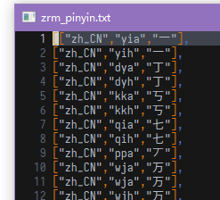
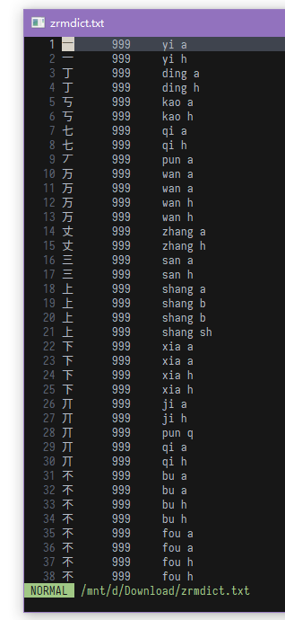

## 成品

### 下载字典

直接下载仓库中的zrmdict.txt

分流:[百度网盘](https://pan.baidu.com/s/1gTDzORF_1IueKvCdWfH5sw) 提取码: p4fr

### 导入字典

**注意事项：导入前请先导出现有个人字典留作备份。**

将zrmdict.txt下载到手机任意位置，依次点击谷歌拼音输入法设置-字典-导入用户字典-选择，选择zrmdict.txt后点击确定即可。

### 使用方法

打字时输入单个辅助码即可，字典中的字在右下角会有...的标识。  
注：目前不支持双辅助码，原因见本文的制作过程。  

## 制作过程

手机输入法一直在手心输入法和谷歌输入法中间纠结。谷歌输入法有纠错和滑行输入，手心输入法有辅助码。最近给pc折腾了下rime输入法发现rime有自然码的码表，于是打算动手移植到谷歌输入法上。

### 自然码表
我使用的基础码表是bigshans简洁化后的自然码表：[rime-zrm](https://github.com/bigshans/rime-zrm)  
  
可以看到格式是<单个汉字><TAB><汉字拼音>;<双辅码>  
因为只留下了单汉字和双辅码，比zrm2000好处理。

### 安卓用户字典

一开始我是打算用安卓系统的全局用户字典，也就是谷歌输入法的自定义短语，通用性更好，也确实做了个成品。  
  
但是我发现在谷歌输入法上的效果并不好，于是废弃。

### 谷歌输入法用户字典

然后我们再看看谷歌拼音输入法的字典文件  
  
除掉小部分带"\\"转义的，可以看出来格式是<词><TAB><未知数字><TAB><拼音组>  
这个未知数字很可能是输入次数或者权重什么的。  
第7行也能看出来拼音组的结尾支持单个声母。

### 处理分析

1. 因为输入法的用户字典只有一个，我们不能让辅助码干扰正常输入和个人字典的词组，所以必须排除双辅助码改用单辅助码。
2. 谷歌用户字典的拼音组很明显是全拼的，所以我们需要把自然码改成全拼。
3. 因为辅助码是为了快速找词的，所以我们要让辅助码优先显示。鉴于谷歌拼音输入法有词频调整，所以我们将未知数字设为999可以使辅助码选字优先出现。

### 处理过程

此处省略通过vim处理码表的一万条命令

### 处理结果

### 改进目标

做完后反思了下还有能改进的空间，时间关系没继续改下去。

1. 我只是为了处理方便用的单字辅助码，其实用完整的zrm2000码表来处理的话，词组辅助码也是可以支持的（可能会增加输入法内存占用）。
2. 因为有些双辅码是不成拼音的，比如侧（ce rz），显然拼音没有rei。所以这些双辅码其实是可以添加进字典且不干扰正常词组输入的。
3. 码表里包含繁体字，这些繁体字在正常输入是不必要的，甚至会成为干扰项，大可以去掉。

以后有时间可能会继续更新，也欢迎大家来改善码表或者分享你们的码表。
